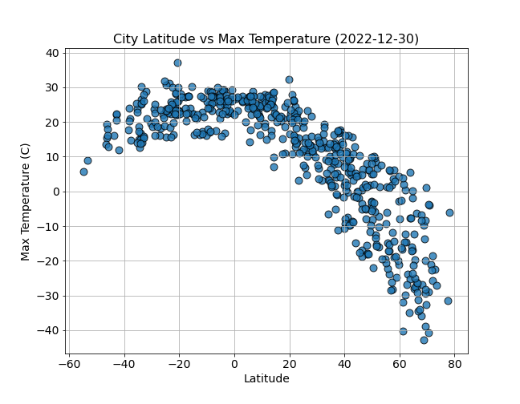
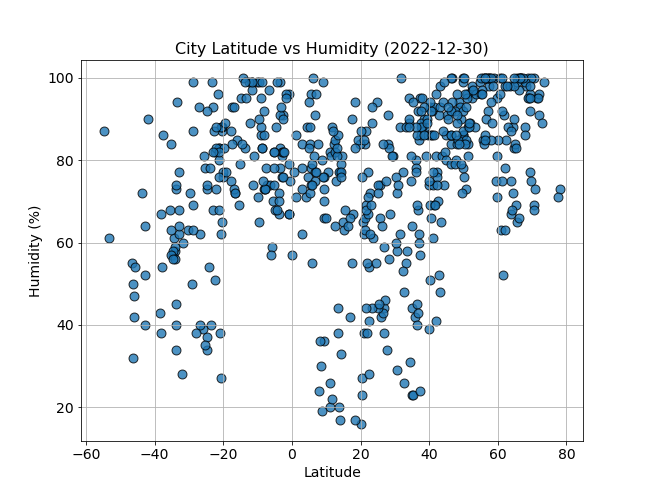
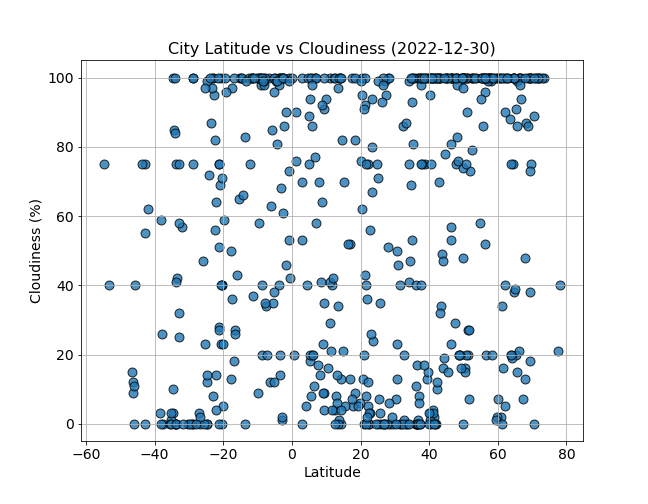
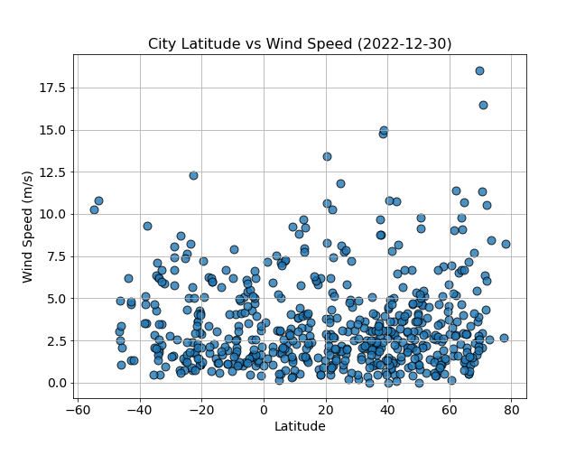

# Weather and Vacation Analysis

## Summary
The Weather and Vacation Analysis project aims to explore the relationship between geographical latitude and weather variables to provide insights for future vacation planning. The analysis includes investigating relationships between weather variables and latitude, as well as guiding vacation choices based on specific weather conditions.

## Introduction
This project aims to explore the relationship between geographical latitude and weather variables, providing insights for future vacation planning. The analysis revolves around two main elements:
- Investigating Relationships
- Guiding Vacation Choices

## Investigating Relationships
To kick off the project, we explore the correlation between weather variables and latitude. Utilizing the citipy library, we generate a list of more than 500 cities, with the OpenWeatherMap API providing the corresponding weather data for each city.

### WeatherPy
WeatherPy focuses on scatter plot creation, demonstrating the relationship between diverse weather variables and latitude. Interestingly, temperature exhibits a trend of increasing as we approach the equator, with the Northern Hemisphere presenting a higher level of variability. Both humidity and cloudiness do not show a clear correlation with latitude. For a more detailed investigation, we also apply linear regression on these relationships, categorizing the data into the Northern and Southern Hemispheres.

- Latitude vs Temperature 

    

- Latitude vs Humidity

    

- Latitude vs Cloudiness

    

- Latitude vs Wind Speed

    

## Guiding Vacation Choices
### VacationPy
VacationPy, the second component of the project, focuses on aiding future vacation planning. We start by generating a map displaying cities selected randomly based on their humidity levels. Following this, the weather data is filtered to pinpoint cities meeting specific conditions in terms of temperature, wind speed, cloudiness, and humidity. The Geoapify API assists in identifying hotels within a 10,000-meter radius of the city coordinates, making it simpler for users to find accommodation in cities matching their preferred weather conditions.

## Conclusion
The project provides a valuable tool for understanding the relationship between weather variables and geographical latitude, as well as assisting in future vacation planning based on desired weather conditions. While the results provide useful insights, it is essential to remember that other factors may influence the observed relationships.

## Getting Started / How to Use
To get started with this project:

1. **Clone the Repository:** You can clone the repository to your local machine by navigating to the main page of the repository on GitHub, clicking on the 'Code' button, and then selecting the 'Clone' option.

2. **Install Dependencies:** Certain Python libraries are required to run the code, and these can be installed using pip, Python's package installer. The needed libraries are Citipy, OpenWeatherMap API, Geoapify API, Matplotlib, Pandas, Requests, Gmaps, JSON, and SciPy.

3. **Obtain API Keys:** API keys are required for both OpenWeatherMap and Geoapify. Registration for these keys can be completed on their respective websites. Once obtained, the keys need to be inserted into the api_keys.py file.

4. **Run the Jupyter Notebooks:** The code is primarily contained in two Jupyter Notebooks: WeatherPy.ipynb and VacationPy.ipynb. These can be executed using Jupyter Notebook or Jupyter Lab.
    - **WeatherPy:** Run all cells in the notebook to generate scatter plots and linear regression models illustrating the relationships between various weather conditions and latitude.

    - **VacationPy:** Running all cells in this notebook will create a heat map showing humidity levels in selected cities around the world and identify hotels within a 10,000-meter radius of cities meeting specific weather conditions.

## Tools
- Python
- Jupyter Notebook
- Pandas
- Numpy
- Matplotlib
- Scipy
- Citipy
- OpenWeatherMap API
- Geoapify API

## Files
- [Investigating Relationships](./WeatherPy/WeatherPy.ipynb)
- [Guiding Vacation Choices](./VacationPy/VacationPy.ipynb)
- [Output Files](./WeatherPy/output_data)
